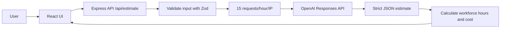
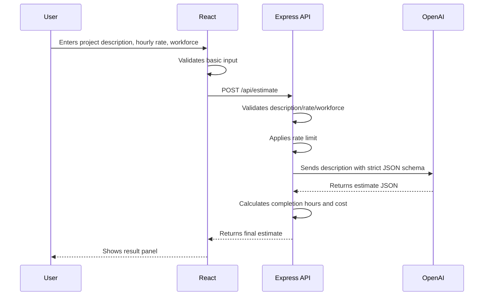

# AI Project Estimator React

A standalone React.js conversion of the **Generic AI Estimator** WordPress plugin. It keeps the same visual design, fields, loader animation, result panel, validation rules, OpenAI structured JSON response flow, rate limiting, and cost/workforce calculations.

> Security note: API keys are never placed in React frontend code. The OpenAI key is stored only in the backend `.env` file, which is ignored by Git.

---

## Preview

```text
+------------------------------------------------------+--------------------------------------+
| AI Project Estimator                                 | What you'll get                      |
| Describe your project and get an instant AI-based... | AI-generated estimation based...     |
|                                                      |                                      |
| + How estimation works ----------------------------+ | + Loader / Result Panel -----------+ |
| | AI analyzes your description, estimates effort... | | Analysing your project request    | |
| +--------------------------------------------------+ | | 1 Reading project description     | |
|                                                      | | 2 Breaking down scope             | |
| Project Description                                  | | 3 Estimating effort               | |
| [textarea]                                           | | 4 Calculating cost range          | |
|                                                      | | 5 Preparing estimate              | |
| Hourly Charge USD     Workforce                      | +----------------------------------+ |
| [30]                  [1]                            |                                      |
|                                                      | + AI Estimate ---------------------+ |
| [Generate Estimate]                                  | | Project Type                     | |
|                                                      | | Complexity                       | |
|                                                      | | Total AI Estimated Effort         | |
|                                                      | | Workforce                        | |
|                                                      | | Completion Hours                 | |
|                                                      | | Estimated Cost                   | |
|                                                      | +----------------------------------+ |
+------------------------------------------------------+--------------------------------------+
```

## Architecture



## Original WordPress Plugin Mapping

| WordPress Plugin Area | React Project Equivalent |
|---|---|
| `[ai_estimator]` shortcode HTML | `src/components/AiEstimator.jsx` |
| Inline CSS from `get_inline_css()` | `src/styles.css` |
| Inline JavaScript from `get_inline_js()` | React state/hooks in `AiEstimator.jsx` |
| WordPress REST route `/wp-json/ai-estimator/v1/estimate` | Express route `/api/estimate` |
| `OPENAI_API_KEY` WordPress constant | `.env` backend variable `OPENAI_API_KEY` |
| WordPress transient rate limiting | `express-rate-limit` |
| WordPress sanitization/validation | `zod` request validation |

## Features

- React.js frontend with the same layout and styling as the WordPress plugin.
- Secure Express backend proxy for OpenAI API calls.
- No confidential keys committed to the repository.
- `.env.example` included for local setup.
- Same validation limits:
  - Minimum description length: 20 characters
  - Maximum description length: 4000 characters
  - Hourly charge: `1` to `10000`
  - Workforce: `1` to `100`
- Same loader steps and progress animation.
- Same estimate result fields:
  - Project Type
  - Complexity
  - Total AI Estimated Effort
  - Workforce
  - Estimated Completion Hours
  - Hourly Charge
  - Estimated Cost
  - Summary
  - Assumptions

## Tech Stack

- React
- Vite
- Express
- OpenAI Responses API
- Zod
- Helmet
- CORS
- Express Rate Limit

## Folder Structure

```text
ai-estimator-react/
├── server/
│   └── index.js              # Secure backend API proxy
├── src/
│   ├── components/
│   │   └── AiEstimator.jsx   # Main estimator UI and logic
│   ├── services/
│   │   └── estimateApi.js    # Frontend API client
│   ├── App.jsx
│   ├── main.jsx
│   └── styles.css            # Converted plugin CSS
├── .env.example              # Safe environment template
├── .gitignore                # Keeps .env and build files out of Git
├── index.html
├── package.json
└── README.md
```

## Local Setup

### 1. Clone the repository

```bash
git clone <your-repository-url>
cd ai-estimator-react
```

### 2. Install dependencies

```bash
npm install
```

### 3. Create your local environment file

```bash
cp .env.example .env
```

Edit `.env`:

```bash
OPENAI_API_KEY=your_openai_api_key_here
OPENAI_MODEL=gpt-5.4-mini
PORT=5174
CLIENT_ORIGIN=http://localhost:5173
```

Do not commit `.env`. It is already ignored by `.gitignore`.

### 4. Run locally

```bash
npm run dev
```

Frontend:

```text
http://localhost:5173
```

Backend:

```text
http://localhost:5174
```

Health check:

```text
http://localhost:5174/api/health
```

## Production Build

```bash
npm run build
npm run preview
```

For production hosting, deploy the React build output from `dist/` and deploy the Express server separately, or place both behind the same domain using a reverse proxy.

## Environment Variables

| Variable | Required | Example | Description |
|---|---:|---|---|
| `OPENAI_API_KEY` | Yes | `sk-...` | Server-side OpenAI API key. Never expose in React. |
| `OPENAI_MODEL` | No | `gpt-5.4-mini` | Model used for estimates. Defaults to `gpt-5.4-mini`. |
| `PORT` | No | `5174` | Backend server port. |
| `CLIENT_ORIGIN` | No | `http://localhost:5173` | Allowed frontend origin for CORS. |

## API Usage

### Endpoint

```http
POST /api/estimate
Content-Type: application/json
```

### Request Body

```json
{
  "description": "Build a marketplace app with customer, vendor, and admin panels.",
  "hourly_rate": 30,
  "workforce": 1
}
```

### Response Body

```json
{
  "success": true,
  "project_type": "Marketplace Web and Mobile App",
  "complexity": "High",
  "min_total_hours": 240,
  "max_total_hours": 420,
  "min_completion_hours": 240,
  "max_completion_hours": 420,
  "hourly_rate": 30,
  "workforce": 1,
  "min_cost": 7200,
  "max_cost": 12600,
  "summary": "Estimated effort for a professional marketplace implementation.",
  "assumptions": [
    "Includes frontend and backend implementation",
    "Includes standard authentication and dashboards"
  ]
}
```

## Security Guidelines

- Never put `OPENAI_API_KEY` in `src/`, `public/`, or any frontend file.
- Never commit `.env`.
- Use `.env.example` to show required variables without real secrets.
- Keep API calls to OpenAI on the Express server only.
- Restrict `CLIENT_ORIGIN` in production.
- Add server-side authentication if you expose the app publicly.
- Adjust rate limits for your production usage pattern.

## Functional Flow



## Deployment Notes

### Frontend

Deploy the React app to Netlify, Vercel, Cloudflare Pages, or any static host.

Set this environment variable if the backend is on a different domain:

```bash
VITE_API_URL=https://your-api-domain.com/api/estimate
```

### Backend

Deploy the Express server to Railway, Render, Fly.io, AWS, or any Node.js server.

Set production variables on the server dashboard:

```bash
OPENAI_API_KEY=your_real_key
OPENAI_MODEL=gpt-5.4-mini
PORT=5174
CLIENT_ORIGIN=https://your-frontend-domain.com
```

## GitHub Push Instructions

After creating an empty GitHub repository:

```bash
git init
git add .
git commit -m "Convert WordPress AI estimator plugin to React"
git branch -M main
git remote add origin https://github.com/<owner>/<repo>.git
git push -u origin main
```

## Notes for Maintainers

- The UI intentionally keeps the original `nx-ai-*` class names to preserve the WordPress plugin design exactly.
- The frontend no longer depends on jQuery. Mobile auto-scroll is handled with `scrollIntoView`.
- The backend mirrors the original WordPress REST behavior and OpenAI structured JSON schema.
- Confidential values must be supplied by each user locally through `.env`.
